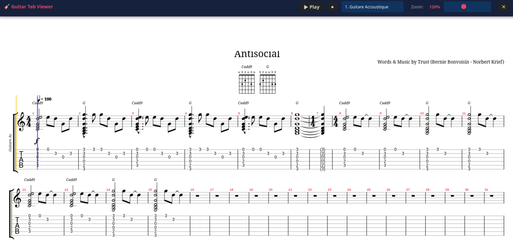

# Guitar Tab Viewer for Nextcloud

[](https://www.gnu.org/licenses/agpl-3.0)
[](https://nextcloud.com)

> A Nextcloud app to view and play Guitar Pro tablature files directly in your browser using alphaTab.



## ✨ Features

- 🎸 **Full Guitar Pro support**: Open `.gp`, `.gp3`, `.gp4`, `.gp5`, `.gpx`, `.gp7` files
- 🎵 **Audio playback**: Built-in MIDI synthesizer with high-quality SoundFont
- 📊 **Professional rendering**: Powered by [alphaTab](https://alphatab.net)
- 🎯 **Interactive cursor**: Visual tracking of playback position
- 📈 **Progress bar**: Click to jump to any position in the song
- 🎛️ **Multi-track support**: Select and display individual tracks
- 🔍 **Adjustable zoom**: From 50% to 200%
- ⚡ **Seamless integration**: Opens in overlay without leaving Files app
- ⌨️ **Keyboard shortcuts**: Close with Escape key

## 📋 Requirements

- **Nextcloud**: Version 28 or higher
- **PHP**: Version 8.0 or higher
- **Node.js**: Version 18+ (for building)
- **npm**: Version 9+ (for building)

## 🚀 Installation

### Method 1: From release archive (recommended)

1. Download the latest release from [Releases](https://github.com/MacFizz/guitartabviewer/releases)
2. Extract to your Nextcloud apps directory:
   ```bash
   tar -xzf guitartabviewer-vX.X.X.tar.gz -C /var/www/nextcloud/apps/
   ```
3. Install dependencies and build:
   ```bash
   cd /var/www/nextcloud/apps/guitartabviewer
   npm install --legacy-peer-deps
   npm run build
   npm run install-alphatab
   ```
4. Set permissions:
   ```bash
   chown -R www-data:www-data /var/www/nextcloud/apps/guitartabviewer
   ```
5. Enable the app:
   ```bash
   sudo -u www-data php /var/www/nextcloud/occ app:enable guitartabviewer
   ```

### Method 2: From source

```bash
cd /var/www/nextcloud/apps/
git clone https://github.com/MacFizz/guitartabviewer.git
cd guitartabviewer
npm install --legacy-peer-deps
npm run build
npm run install-alphatab
chown -R www-data:www-data .
sudo -u www-data php /var/www/nextcloud/occ app:enable guitartabviewer
```

### Post-installation

Update MIME types:
```bash
sudo -u www-data php /var/www/nextcloud/occ maintenance:mimetype:update-db
sudo -u www-data php /var/www/nextcloud/occ maintenance:mimetype:update-js
```

## 🎮 Usage

1. Navigate to **Files** in Nextcloud
2. Click on any Guitar Pro file (`.gp5`, `.gpx`, etc.)
3. The viewer opens in an overlay
4. Use the controls:
   - **▶ Play / ⏸ Pause**: Start/stop playback
   - **⏹ Stop**: Stop and reset to beginning
   - **Track selector**: Choose which track to display
   - **Zoom**: Adjust display size
   - **Progress bar**: Click to jump to any position
   - **✕ Close**: Close viewer (or press Escape)

## 🏗️ Development

### Project structure

```
guitartabviewer/
├── appinfo/
│   ├── info.xml              # App metadata
│   ├── routes.php            # URL routes
│   └── mimetypemapping.json  # MIME type definitions
├── lib/
│   ├── AppInfo/
│   │   └── Application.php   # Main app class
│   └── Controller/
│       └── ViewerController.php  # HTTP controllers
├── templates/
│   └── viewer.php            # Main viewer template
├── src/
│   └── files-integration.js  # Files app integration (source)
├── js/
│   ├── viewer.js             # Viewer logic
│   ├── alphatab.js           # alphaTab library (generated)
│   └── guitartabviewer-files-integration.js  # Bundled (generated)
├── css/
│   └── viewer.css            # Styles
├── soundfont/
│   └── sonivox.sf2           # MIDI SoundFont
└── webpack.config.js         # Build configuration
```

### Building

```bash
# Development build
npm run dev

# Production build
npm run build

# Watch mode
npm run watch
```

### Scripts

- `npm run build` - Build production bundle
- `npm run dev` - Build development bundle
- `npm run install-alphatab` - Copy alphaTab library files

## 🐛 Troubleshooting

### Files don't open in viewer

1. Check app is enabled:
   ```bash
   sudo -u www-data php occ app:list | grep guitartabviewer
   ```
2. Clear browser cache: `Ctrl+Shift+R`
3. Update MIME types (see Post-installation)

### No audio playback

- Check browser console (F12) for errors
- Verify `soundfont/sonivox.sf2` exists and is accessible
- Audio may require user interaction on first play (browser security)

### Partition doesn't display

- Check that `js/alphatab.js` exists
- Verify file permissions
- Check Nextcloud logs: `tail -f /var/www/nextcloud/data/nextcloud.log`

## 🤝 Contributing

Contributions are welcome! Please:

1. Fork the repository
2. Create a feature branch: `git checkout -b feature/amazing-feature`
3. Commit your changes: `git commit -m 'Add amazing feature'`
4. Push to the branch: `git push origin feature/amazing-feature`
5. Open a Pull Request

### Coding standards

- **PHP**: PSR-12
- **JavaScript**: ES6+, semicolons, 4-space indent
- **CSS**: BEM-like naming

## 📄 License

This project is licensed under the GNU Affero General Public License v3.0 - see the [LICENSE](LICENSE) file for details.

## 🙏 Acknowledgments

- [alphaTab](https://alphatab.net) - Guitar tablature rendering engine
- [Nextcloud](https://nextcloud.com) - Self-hosted productivity platform
- All contributors and users of this project

## 📧 Support

- **Issues**: [GitHub Issues](https://github.com/MacFizz/guitartabviewer/issues)
- **Discussions**: [GitHub Discussions](https://github.com/MacFizz/guitartabviewer/discussions)

---

Made with ❤️ for the Nextcloud community
